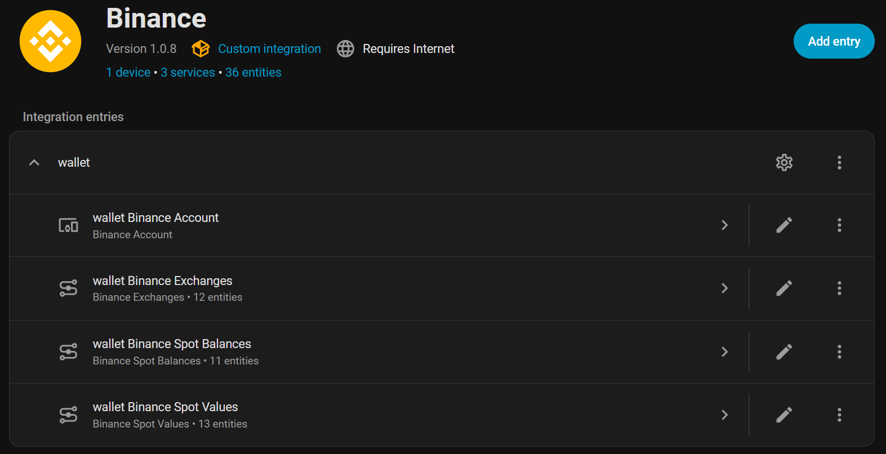
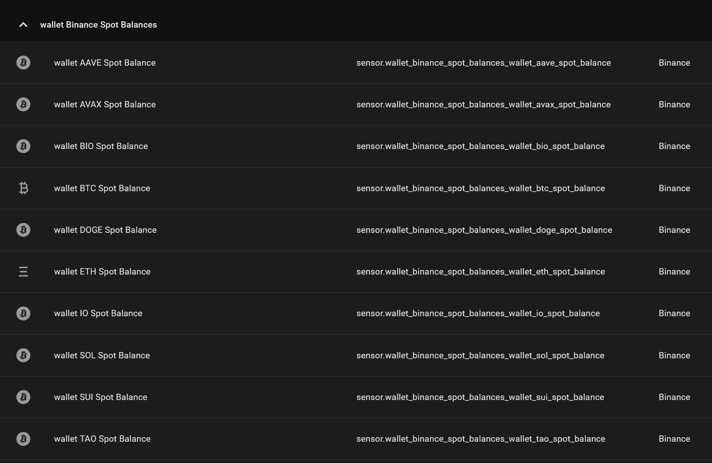
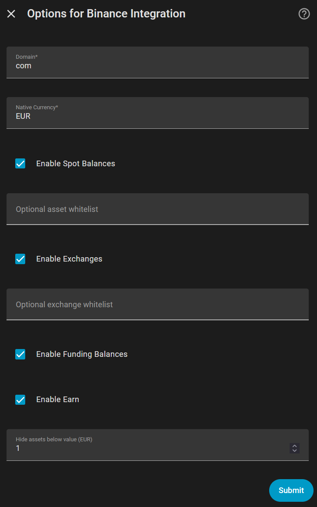

#  Home Assistant Binance — marcovolt Fork

## 🌟 Main benefit

**Your Binance portfolio updates automatically in Home Assistant — without manually entering coin symbols.**

An **unofficial fork** of the original Binance integration by **YouNesta**, focused on one key improvement:

This fork detects wallet assets automatically, creates the relevant sensors, and converts portfolio values directly into **EUR**.

## ✨ No more manual coin lists

This fork is designed to make Binance portfolio tracking feel automatic and practical inside Home Assistant.

Instead of manually entering coin symbols and exchange pairs, the integration can automatically:

- detect assets held in your Binance wallet
- create balance sensors
- create value sensors
- create exchange sensors
- calculate the total portfolio value
- convert everything automatically to **EUR**

That is the core advantage of this fork.

---

## 🚀 Why this fork stands out

### 🔍 Automatic wallet asset detection
No need to manually maintain lists of coin codes.

### 💶 Automatic EUR conversion
Asset values are calculated directly in EUR whenever possible.

### 📊 Portfolio-ready sensors
The integration automatically creates the sensors you actually need for dashboards:

- Spot Balance
- Spot Value
- Exchange
- Portfolio Total
- Portfolio Total Graph

### 🧹 Cleaner and smarter
This fork also improves day-to-day usability:

- cleaner entity names
- `LD*` asset filtering
- optional minimum value filter
- improved options flow
- better dashboard support

---

## 🧠 What this means in practice

When you buy a new coin on Binance:

- the wallet is scanned automatically
- the asset can appear automatically in Home Assistant
- its balance and value are created automatically
- its value is converted to EUR
- your portfolio dashboard becomes much easier to maintain

This makes the integration much better suited for **real dynamic portfolios**.

---

## 🏷️ Example entity naming

This fork uses cleaner entity IDs such as:

- `sensor.marcovolt_binance_eth_spot_balance`
- `sensor.marcovolt_binance_eth_spot_value`
- `sensor.marcovolt_binance_etheur_exchange`
- `sensor.marcovolt_binance_portfolio_total`
- `sensor.marcovolt_binance_portfolio_total_graph`

---

## 🖼️ Screenshots

### Integration overview

### Automatically detected portfolio assets

### Dashboard example

### Integration options

---

## 🔧 Key features

- ✅ Automatic Binance wallet asset detection
- ✅ Automatic EUR portfolio valuation
- ✅ Automatic Spot / Value / Exchange / Total sensor creation
- ✅ Cleaner entity naming
- ✅ Configurable minimum asset value threshold
- ✅ `LD*` asset filtering
- ✅ Graph-friendly portfolio total sensor
- ✅ Better Home Assistant dashboard usability

---

## 📦 Installation

### HACS (Custom Repository)

1. Open **HACS**
2. Open the menu in the top right corner
3. Select **Custom repositories**
4. Add this repository URL
5. Category: **Integration**
6. Install the repository
7. Restart Home Assistant
8. Add the Binance integration from **Devices & Services**

### Manual installation

1. Copy `custom_components/binance` into your Home Assistant `custom_components` folder
2. Restart Home Assistant
3. Add the Binance integration from **Devices & Services**

---

## ⚙️ Configuration

This fork is designed to work best in **automatic mode**.

In most cases, you do **not** need to manually configure:

- asset lists
- exchange pair lists

Optional controls are still available if needed, including:

- minimum asset value filter
- optional asset whitelist
- optional exchange whitelist

---

## 📌 Notes

- This is an **unofficial fork**
- Original project credit belongs to **YouNesta**
- Main focus: **Binance Spot portfolio tracking in EUR**
- Some conversion paths may still depend on Binance market availability
- Old entities from previous versions may remain in Home Assistant until manually removed

---

## ⚠️ Disclaimer

This project is not affiliated with Binance.

Use it at your own risk, and always verify financial data before making trading decisions.

---

## 🙌 Credits

Original integration by **YouNesta**.  
This fork builds on that work and focuses on automation, EUR valuation, and dashboard usability.

---

## ☕ Support

If this project saved you time or improved your Home Assistant setup, you can support it here:

[Ko-fi / Buy me a coffee](https://ko-fi.com/marcovolt18)